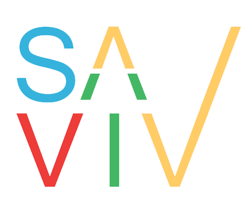

<!DOCTYPE html>
<html lang="en">
<head>
    <meta charset="UTF-8">
    <meta name="viewport" content="width=device-width, initial-scale=1.0">
    <meta http-equiv="X-UA-Compatible" content="ie=edge">
    <title>Document</title>
    <link rel="stylesheet" href="./style.css">
</head>
<body>
    
    

        

            
        

        
        

            <a class="active" href="#">Home</a>
            <a href="#">Skills</a>
            <a href="#">Qualifications</a>
            <a href="#">Contact</a>
            
        

            
        

    

    

        

            <h1>Welcome !!!</h1>

            
I'm Savina Weerasooriya and this is my personal web application built using completely scratch.

              
            <a href="#skill">
                <input type="button" class="btnBlue" value="Learn more">
            </a>
        

    

    <section class="sectionSkill" id="skill">
        Hellow world
    </section>
    
</body>
</html>
